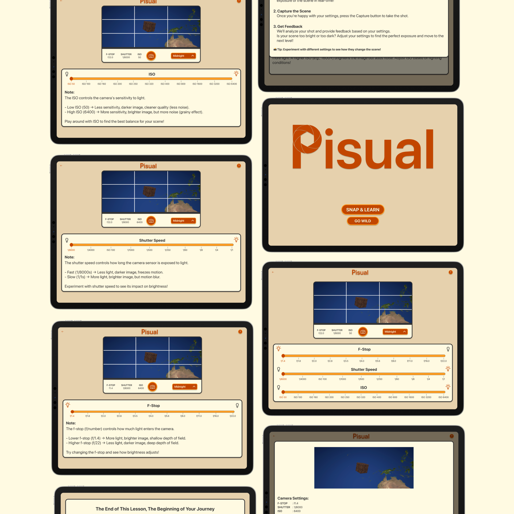
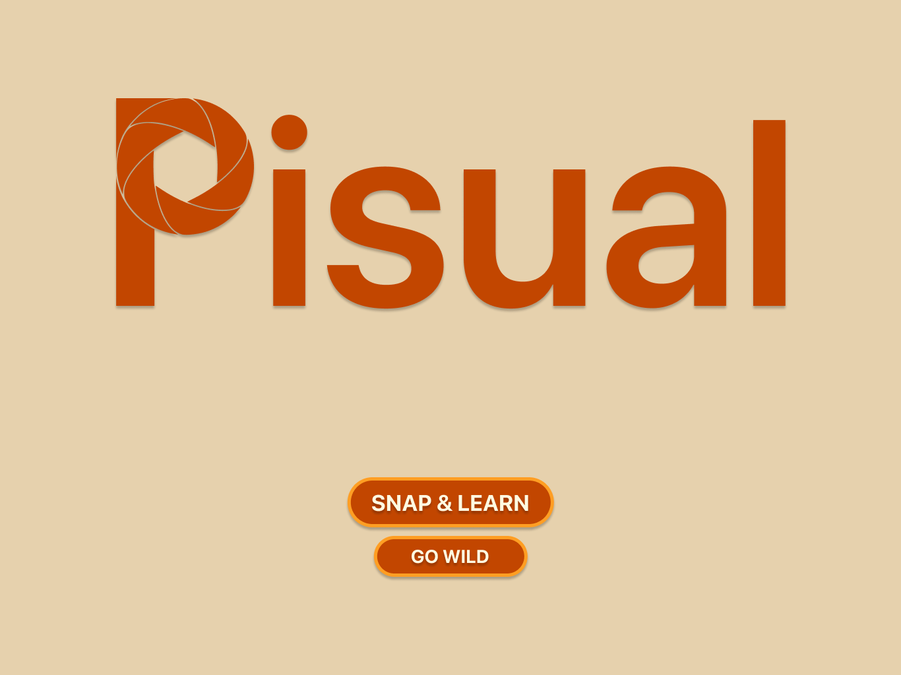
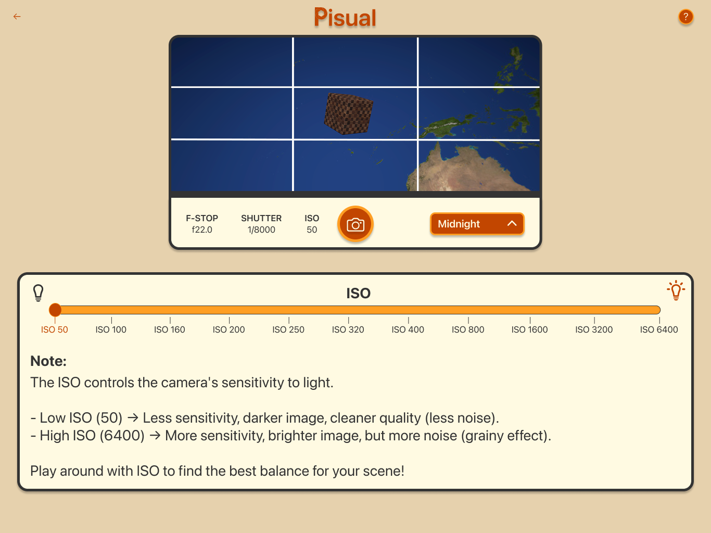
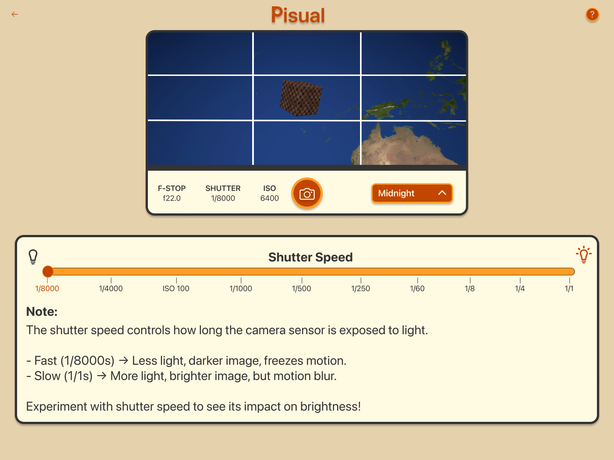
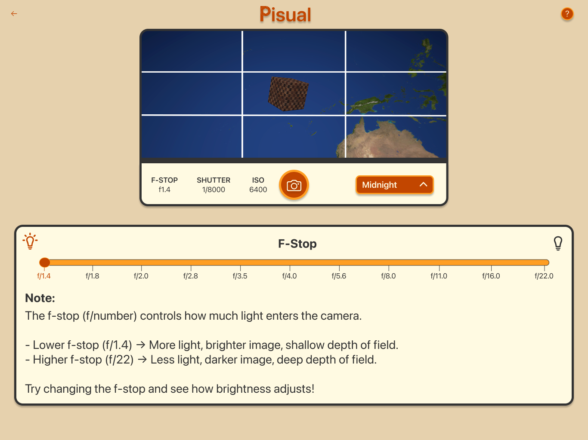
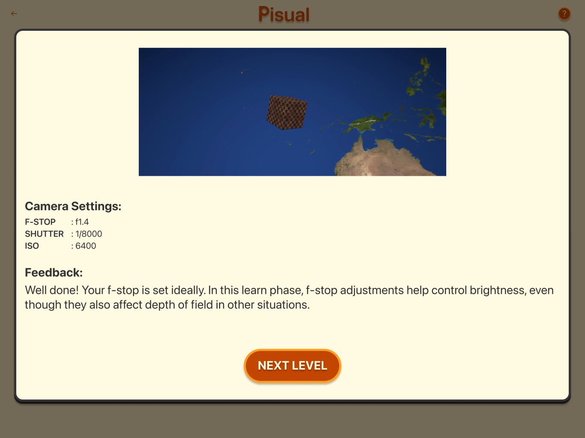
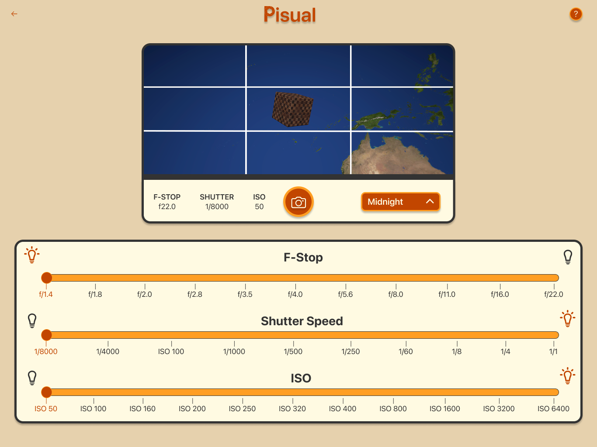

# 📸 Pisual

**Pisual** is an interactive game that teaches users how f-stop, shutter speed, and ISO adjustments affect camera brightness.  
Through exciting challenges and experiments, players learn the core principles of the **exposure triangle**, enhancing both technical photography skills and creative vision.  

Master camera settings and achieve excellent exposure in a **fun, immersive, and educational** experience.

---

## 📖 Overview
Photography can seem intimidating for beginners, especially when it comes to balancing camera settings. Pisual simplifies this process by allowing users to experiment with exposure in a safe, virtual environment.  

- Adjust f-stop, shutter speed, and ISO in real time  
- Instantly see how each change affects brightness  
- Explore different lighting conditions and challenges  
- Learn by experimenting, not by memorizing  

This hands-on approach transforms trial and error into **active learning**, making photography more approachable and inspiring for all.

---

## ✨ Features
- 🎮 Interactive challenges that simulate real-world photography scenarios  
- 🌗 Real-time feedback when adjusting f-stop, shutter speed, and ISO  
- 📷 Dynamic lighting conditions to practice exposure control  
- 📖 A fun and engaging way to learn the **exposure triangle**  

---

## 🎮 User Experience & Design Choices
The goal of Pisual is to create an **immersive, interactive learning experience** where players can experiment freely without the risk of missing a shot in the real world.  

- Every camera adjustment provides **instant, visual feedback**, making the connection between theory and practice clear.  
- The simulation encourages **exploration and creativity**, showing how small changes can dramatically affect a photo’s outcome.  
- By learning through experimentation, users gain confidence in handling exposure settings, both as beginners and as aspiring photographers.  

To bring this vision to life:  
- **SceneKit** was used for real-time rendering and smooth, responsive interactions.  
- **SwiftUI** powers the intuitive user interface, making adjustments simple and visual.  
- Together, they provide a seamless blend of interactivity, clarity, and engagement.  

---

## 🛠️ Technologies Used
- **Swift** – Core programming language  
- **SwiftUI** – For intuitive, user-friendly controls and interface  
- **SceneKit** – For real-time rendering and interactive camera simulations  

---

## 📸 Screenshots

  

  
  
  

  
  
    

---

## 🚀 About
Created for the **Swift Student Challenge (2025)**.  
